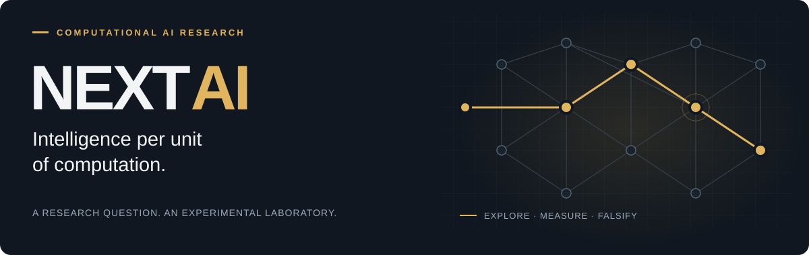
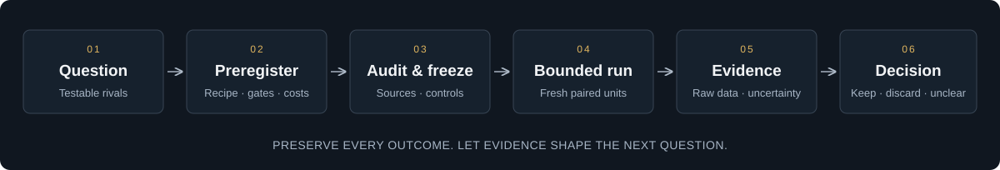

<p align="center">
  
</p>

<h3 align="center">A falsification-first laboratory for computational AI research.</h3>

<p align="center">Preregister the question. Test the mechanism. Count the full cost. Keep the evidence.</p>

<p align="center">
  <a href="pyproject.toml"></a>
  <a href="pyproject.toml"></a>
  <a href="docs/SCIENTIFIC_PROTOCOL.md"></a>
  <a href="docs/CURRENT_STATUS.md"></a>
</p>

<p align="center">
  <a href="#quick-start">Quick start</a> ·
  <a href="#research-evidence">Research evidence</a> ·
  <a href="#how-the-laboratory-works">How it works</a> ·
  <a href="#documentation">Documentation</a> ·
  <a href="README.pl.md">Polski</a>
</p>

---

## The research question

**Can useful intelligence require less computation as stored knowledge grows?**

NEXTAI explores computational principles that might improve capability per unit of **end-to-end inference cost** relative to dense autoregressive language models. The search spans structured memory, learned retrieval, local updates, adaptive computation, causal models and program-like mechanisms.

The repository combines a local Python experiment harness with a versioned research record. Codex supplies scientific judgment in the working chat; the package supplies preregistration, measurement, integrity checks and durable bookkeeping. The evaluated candidates do not call an external model or model API.

The long-term ambition is a different computational architecture for AI. The current deliverable is an experimental laboratory and its evidence: **no architecture has been promoted, and no advantage over frontier LLMs has been established.**

## What is inside

| Component | What it does | Where to look |
| :--- | :--- | :--- |
| **Experiment harness** | Audits candidate dependencies, checks frozen sources, launches bounded workers and records raw trials. | [Runner](src/nextai_autoresearch/runner.py) · [CLI](src/nextai_autoresearch/cli.py) |
| **Candidate library** | Explores memory, retrieval, recurrence, causal inference, compression and program execution. Includes learned, classical, random and oracle controls. | [Candidates](src/nextai_autoresearch/candidates/) · [Idea catalog](docs/IDEA_CATALOG.md) |
| **Versioned tasks** | Separates benchmark cohorts, legal observations, training splits and evaluation boundaries. | [Benchmarks](src/nextai_autoresearch/benchmarks/) · [Schemas](schemas/) |
| **Full-cost measurement** | Tracks fit, ingest, indexing, updates, query, decoding, state and hardware-dependent service costs. | [Metrics](docs/METRICS.md) |
| **Research ledger** | Preserves preregistrations, results, analyses, failures, budgets and evaluated source archives. | [Research report](research/REPORT.md) · [Data model](docs/DATA_MODEL.md) |

## Quick start

### 1. Get the repository

```powershell
git clone https://github.com/Jaqwilk/NEXTAI.git
cd NEXTAI
```

Use **Python 3.12+** and an already installed **uv**. The current PVM study recipes require an NVIDIA CUDA device; this is separate from reading the evidence or inspecting the CLI. The pinned environment uses PyTorch 2.6.0 from the CUDA 12.4 wheel index.

### 2. Prepare the locked environment

The bootstrap checks the estimated installation/cache footprint and requires **at least 10 GiB to remain free**. It installs the locked development dependencies and runs `doctor`:

```powershell
python scripts/bootstrap_environment.py
```

If you have already checked the disk budget, the underlying installation command is:

```powershell
uv sync --frozen --extra dev
```

Large benchmark payloads and checkpoints stay local. The bootstrap does not acquire research datasets or pretrained models. A fresh machine may report missing local assets; consult the acquisition records in [research/data](research/data/) instead of substituting another dataset.

### 3. Inspect the laboratory

```powershell
uv run nextai --help
uv run nextai doctor
uv run nextai lab status
```

`doctor` checks consistency. `lab status` reports the verified queue, current authority, consumed attempts and remaining compute. **A passing check does not authorize a new experiment.**

For a provisioned research environment, the regression command is `uv run pytest`. Some checks rely on local assets and Windows/CUDA behavior; this is not a promise that a bare clone reproduces every historical run.

## Research evidence

**Snapshot: completed cycle 311, recorded 4 October 2026 (UTC).** The continuation program is active; the current benchmark is in maintenance with `scoring=false` and no paid run pending. Read [current status](docs/CURRENT_STATUS.md) and use `uv run nextai lab status` for the authoritative live queue.

Recent PVM studies ask whether a system can associate **two noisy views of an identity**, answer from mutable memory, retain unaffected facts and reject unknown identities. They use memory sizes **32 / 128 / 512** and update rounds **0 / 1 / 4**. Update rounds are not reasoning depth.

| Study | Recorded finding | Decision and scope |
| :--- | :--- | :--- |
| [Reference learning · 0005](research/analyses/EXP-20261004-0005.md) | Dense full-answer accuracy **99.9861%**; pointer and ridge **99.9722%**, across five fresh paired seed/data units. | **KEEP** the local screening cohort. Ridge matches pointer quality at much lower measured CPU workload cost. |
| [Delta memory · 0006](research/analyses/EXP-20261004-0006.md) | Updated-answer accuracy rises from **39.83% to 100%** versus additive writes; paired gain **+60.17 pp**, simultaneous 98.75% CI **[56.90, 63.43] pp**. | **KEEP** the narrow delta mechanism. Strong classical controls still dominate economically. |
| [Compact features · 0007](research/analyses/EXP-20261004-0007.md) | Learned full-answer accuracy **90.7778%** versus frozen **90.8056%**; the four primary criteria fail. | **DISCARD** this exact 512-feature recipe. The finding does not falsify the architecture family. |
| [Capacity exposure · 0008](research/analyses/EXP-20261004-0008-ADDENDUM-V1.md) | All 80 workers and 720 trials complete, but exact dense/cache decoder identity fails on all five units. | **INCONCLUSIVE** comparison. Matching decisions do not repair a failed identity gate. |
| [Technical conformance · cycle 311](research/analyses/PVM01-REPRO-PREPARATION-ADDENDUM-V1.md) | **36/36** corrected fixed-fixture children; **18/18** deterministic fits with exact identity; **1,127** full regression tests pass. | **KEEP** the technical repair. This is auxiliary conformance, not new scientific or economic evidence. |

Each row belongs to its own frozen comparison. These numbers are **not a pooled leaderboard**; individual questions, episodes and workers are not independent replications. Reports preserve the exact recipes, uncertainty, costs, limitations and failed checks.

<details>
<summary><strong>What remains to be demonstrated?</strong></summary>

The whole-program objective is still open. Later evidence must include:

- An adverse task that discriminates the proposed mechanism from strong classical alternatives.
- Matched-quality economics with the full cost boundary at three scales.
- Independent replication and a frozen recipe evaluated on fresh final units.
- Separate evidence for any transfer, novelty or broader architectural claim.

The proposed next bounded question is learned transport/PCA memory versus strong classical and dense controls, with a preregistered noise interaction. It is a proposal, not a completed study or an active run.

</details>

## How the laboratory works

<p align="center">
  
</p>

1. **Ask a discriminating question.** State the mechanism, rival explanations and the observation that would count against it.
2. **Preregister before implementation and data.** Freeze the task, recipe, controls, grids, metrics, gates, seeds policy and finite costs.
3. **Audit and freeze.** Verify candidate imports, legal data boundaries, source hashes, baseline semantics and preflight readiness.
4. **Run within the declared authority.** Use the audited runner, bounded workers and fresh paired units. Failed attempts stay consumed.
5. **Preserve and decide.** Record raw results, analyze uncertainty and retain, discard or mark the comparison inconclusive.

Learning, economics and transfer are **separate claims**. A useful local mechanism can pass its test while losing to ridge regression on cost. An invalid comparison remains inconclusive even when its accuracy looks attractive.

The inference boundary includes encoding, retrieval, memory movement, computation, decoding and mandatory state/cache maintenance. Training, index construction and updates are also reported, with explicitly declared amortization scenarios. Operation counts are not measured energy; batch throughput is not single-query latency.

See the [scientific protocol](docs/SCIENTIFIC_PROTOCOL.md), [architecture](docs/ARCHITECTURE.md) and [metrics](docs/METRICS.md) for the full contracts. Earlier stage descriptions in documents are preserved history; the latest status and verified CLI queue govern current work.

## Repository map

```text
NEXTAI/
├── src/nextai_autoresearch/
│   ├── candidates/       Computational mechanisms and comparison controls
│   ├── benchmarks/       Versioned evaluation cohorts
│   ├── cli.py            Local nextai commands
│   ├── runner.py         Audited experiment execution
│   └── integrity.py      Protected-source manifests and verification
├── tests/                Measurement, lifecycle and integrity regressions
├── schemas/              Contracts for plans, results and durable state
├── config/               Research configuration and baseline semantics
├── scripts/              Bootstrap, conformance and analysis utilities
├── research/
│   ├── plans/            Immutable preregistrations
│   ├── results/          Raw trials and aggregates
│   ├── analyses/         Scientific interpretation and decisions
│   ├── laboratory/       Authority, receipts and evaluated-source archives
│   └── REPORT.md         Generated, cohort-separated research report
├── docs/                 Protocol, metrics, architecture and research context
├── AGENTS.md             Current authority and scientific invariants
└── program.md            Bounded-cycle workflow and stopping conditions
```

## Documentation

| Start here | Purpose |
| :--- | :--- |
| [Current status](docs/CURRENT_STATUS.md) | Latest completed work, limitations and next bounded question. |
| [Research report](research/REPORT.md) | Cohort-separated results with provenance in [REPORT.provenance.json](research/REPORT.provenance.json). |
| [Scientific protocol](docs/SCIENTIFIC_PROTOCOL.md) | Preregistration, fair controls, evidence standards and claim boundaries. |
| [Metrics and accounting](docs/METRICS.md) | Quality, latency, state, memory movement and full-cost comparisons. |
| [Architecture](docs/ARCHITECTURE.md) · [Data model](docs/DATA_MODEL.md) | Control flow, trust boundaries and immutable records. |
| [Idea catalog](docs/IDEA_CATALOG.md) · [Prior art](docs/PRIOR_ART.md) | Computational families, alternatives and research context. |
| [Original vision](docs/ORIGINAL_MANIFEST.md) · [Roadmap](docs/ROADMAP.md) | Long-term ambition and the historical G0–G8 map. The roadmap is not the live queue. |
| [Safety and autonomy](docs/SAFETY.md) · [Agent instructions](AGENTS.md) | Authority, resource bounds, STOP/PAUSE and data-access restrictions. |

## Contributing

Useful contributions include measurement audits, stronger classical controls, reproducibility fixes and carefully scoped research questions. Open an [issue](https://github.com/Jaqwilk/NEXTAI/issues) describing the question, expected observation and relevant evidence, or propose a focused [pull request](https://github.com/Jaqwilk/NEXTAI/pulls).

Read [AGENTS.md](AGENTS.md), [program.md](program.md) and the [scientific protocol](docs/SCIENTIFIC_PROTOCOL.md) before changing research behavior. Preserve old plans, results, source archives and budget consumption. Protected-source changes require a documented migration; new scientific comparisons require prospective contracts.

<details>
<summary><strong>Execution and reproducibility boundaries</strong></summary>

- Root-level `STOP` or `PAUSE`, active locks and maintenance mode gate experimental execution.
- WT files 8–9 remain outside the authorized access scope.
- Candidate import audits and separate processes assume cooperative code; they are not a hardened OS sandbox.
- Locally visible development evidence does not establish an independently blind holdout.
- Historical runs may require local data, exact evaluated source and recorded hardware/software.
- Application scheduling is separate from repository documentation. Editing a README does not start a research cycle.

</details>

---

<p align="center">
  <strong>Evidence before architecture.</strong><br>
  <sub>Every retained idea should survive a test designed to prove it wrong.</sub>
</p>
